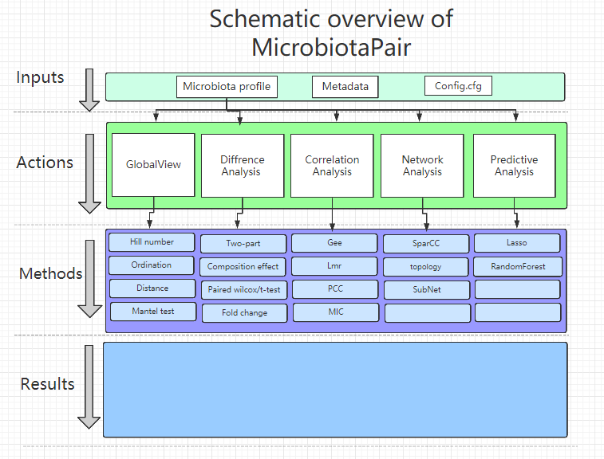

# microbiotaPair


`microbiotaPair` defines microbiota study to Pair sample. The
goal is to  Simplified Microbiome Analysis Workflows  on Intervention Study




Contributors
------------

-   [Huahui Ren](https://github.com/rusher321)
-   [Hua Zou](https://github.com/zouhua)

Comments and contributions
--------------------------

Installation
------------

This package can be installed using [devtools](http://cran.r-project.org/web/packages/devtools/index.html).

``` r
devtools::install_github('rusher321/microbiotaPair')
```

We welcome comments, criticisms, and especially contributions! GitHub
issues are the preferred way to report bugs, ask questions, or request
new features. You can submit issues here:

<https://github.com/rusher321/microbiotaPair/issues>

Meta
----

-   Please [report any issues or
    bugs](https://github.com/rusher321/microbiotaPair/issues).
-   License: MIT
-   Get citation information for `taxa` in R doing
    `citation(package = 'microbiotaPair')`
-   Please note that this project is released with a [Contributor Code
    of Conduct](CONDUCT.md). By participating in this project you agree
    to abide by its terms.
